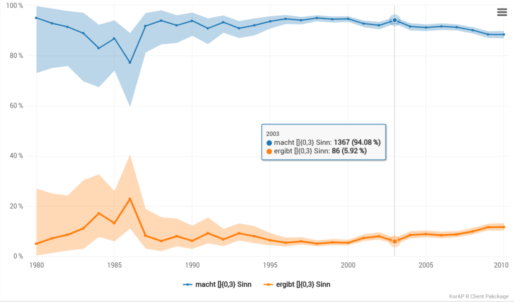

# KorAP web service client package for R
---
[](https://cran.r-project.org/package=RKorAPClient)
[](http://www.r-pkg.org/pkg/RKorAPClient)
[](https://www.repostatus.org/#active)
[](https://www.tidyverse.org/lifecycle/#stable)
[](https://codecov.io/gh/KorAP/RKorAPClient?branch=master)
[](https://github.com/KorAP/RKorAPClient/issues)
[](https://github.com/KorAP/RKorAPClient/issues)
[](https://github.com/KorAP/RKorAPClient/issues)
[](https://github.com/KorAP/RKorAPClient/actions?workflow=check-windows)
[](https://github.com/KorAP/RKorAPClient/actions?workflow=check-mac)
[](https://github.com/KorAP/RKorAPClient/actions?workflow=check-linux)
[](https://github.com/KorAP/RKorAPClient)

## Description

R client package to access the [web service API](https://github.com/KorAP/Kustvakt/wiki) of the [KorAP Corpus Analysis Platform](https://korap.ids-mannheim.de/) developed at [IDS Mannheim](http://www.ids-mannheim.de/)

## Installation
### System Dependencies on Linux
`RKorAPClient` uses some R packages with system depencies you might need to install first:
```bash
#### Debian / Ubuntu
sudo apt install r-base-dev libcurl4-gnutls-dev libxml2-dev libsodium-dev

#### Fedora / CentOS >= 8 / RHEL >= 8
sudo dnf install R-devel libcurl-devel openssl-devel libxml2-devel libsodium-devel

#### CentOS < 8 / RHEL < 8
sudo yum install R-devel libcurl-devel openssl-devel libxml2-devel libsodium-devel

#### Arch Linux
pacman -S base-devel gcc-fortran libsodium curl
```
### Package installation
#### CRAN version:
```r
install.packages("RKorAPClient")
```

#### Development version (alternatives):
```r
devtools::install_github("KorAP/RKorAPClient")
remotes::install_github("KorAP/RKorAPClient")
devtools::install_git("https://korap.ids-mannheim.de/gerrit/KorAP/RKorAPClient")
remotes::install_git("https://korap.ids-mannheim.de/gerrit/KorAP/RKorAPClient")
```

## Examples
### Hello world

```R
library(RKorAPClient)
new("KorAPConnection", verbose=TRUE) %>% corpusQuery("Hello world") %>% fetchAll()
```

### Frequencies over time and domains using ggplot2
```r
library(RKorAPClient)
library(ggplot2)
kco <- new("KorAPConnection", verbose=TRUE)
expand_grid(condition = c("textDomain = /Wirtschaft.*/", "textDomain != /Wirtschaft.*/"), 
            year = (2002:2018)) %>%
    cbind(frequencyQuery(kco, "[tt/l=Heuschrecke]", paste0(.$condition," & pubDate in ", .$year)))  %>%
    ipm() %>%
    ggplot(aes(x = year, y = ipm, fill = condition, colour = condition)) +
    geom_freq_by_year_ci()
```
<!-- -->

### Percentages over time using [highcharter](http://jkunst.com/highcharter/)
See the [Highcharts license notes](#highcharts) below.
```r
library(RKorAPClient)
query = c("macht []{0,3} Sinn", "ergibt []{0,3} Sinn")
years = c(1980:2010)
as.alternatives = TRUE
vc = "textType = /Zeit.*/ & pubDate in"
new("KorAPConnection", verbose=T) %>%
  frequencyQuery(query, paste(vc, years), as.alternatives = as.alternatives) %>%
  hc_freq_by_year_ci(as.alternatives)
```
[<!-- -->](https://korap.github.io/RKorAPClient/man/figures/Readme-Example-2.html)

## Demos

More elaborate R scripts demonstrating the use of the package can be found in the [demo](demo) folder.

## Development and License
### RKorAPClient

**Authors**: [Marc Kupietz](http://www1.ids-mannheim.de/zfo/personal/kupietz/), [Nils Diewald](http://www1.ids-mannheim.de/zfo/personal/diewald/)

Copyright (c) 2020, [Leibniz Institute for the German Language](http://www.ids-mannheim.de/), Mannheim, Germany

This package is developed as part of the [KorAP](http://korap.ids-mannheim.de/)
Corpus Analysis Platform at the Leibniz Institute for German Language
([IDS](http://www.ids-mannheim.de/)).

It is published under the
[BSD-2 License](LICENSE.md).

### Further Affected Licenses and Terms of Services

#### Highcharts
RKorAPClient imports parts of the [highcharter package](https://cran.r-project.org/package=highcharter) which has a dependency on Highcharts, a commercial JavaScript charting library. Highcharts offers both a commercial license as well as a free non-commercial license. Please review the licensing options and terms before using the highcharter plot options, as the `RKorAPClient` license neither provides nor implies a license for Highcharts.

[Highcharts](http://highcharts.com) is a Highsoft product which is not free for commercial and governmental use.

### Accessed API Services
By using RKorAPClient you agree to the respective terms of use of the accessed KorAP API services which will be printed upon opening a connection (`new("KorAPConnection", ...`).

## Contributions

Contributions are very welcome!

Your contributions should ideally be committed via our [Gerrit server](https://korap.ids-mannheim.de/gerrit/)
to facilitate reviewing (see [Gerrit Code Review - A Quick Introduction](https://korap.ids-mannheim.de/gerrit/Documentation/intro-quick.html)
if you are not familiar with Gerrit). However, we are also happy to accept comments and pull requests
via GitHub.

Please note that unless you explicitly state otherwise any
contribution intentionally submitted for inclusion into this software shall –
as this software itself – be under the [BSD-2 License](LICENSE.md).

## References

- Kupietz, Marc / Margaretha, Eliza / Diewald, Nils / Lüngen, Harald / Fankhauser, Peter (2019): [What’s New in EuReCo? Interoperability, Comparable Corpora, Licensing](https://nbn-resolving.org/urn:nbn:de:bsz:mh39-90261). In: Bański, Piotr/Barbaresi, Adrien/Biber, Hanno/Breiteneder, Evelyn/Clematide, Simon/Kupietz, Marc/Lüngen, Harald/Iliadi, Caroline (eds.): [*Proceedings of the International Corpus Linguistics Conference 2019 Workshop "Challenges in the Management of Large Corpora (CMLC-7)"*](https://ids-pub.bsz-bw.de/solrsearch/index/search/searchtype/collection/id/21038), 22nd of July Mannheim: Leibniz-Institut für Deutsche Sprache, 33-39.

- Kupietz, Marc / Diewald, Nils / Margaretha, Eliza (forthcoming): RKorAPClient: An R package for accessing the German Reference Corpus DeReKo via KorAP. In: Proceedings of the Twelfth International Conference on Language Resources and Evaluation (LREC 2020). Marseille/Paris: European Language Resources Association (ELRA). 
